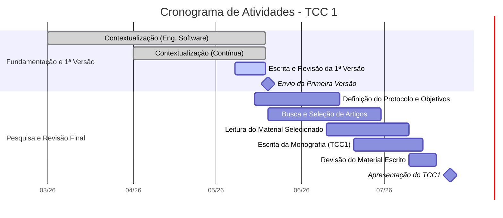

# Cronograma de TCC 1

**Período:** Março a Julho de 2026
**Deadline da Primeira Versão:** 20/05/2026
**Apresentação:** Julho/2026

## 📊 Gráfico de Gantt do TCC 1

## 🎯 Sprint: Entrega da Primeira Versão (até 20/05)
Foco imediato para o documento inicial.

| Data | Atividade | Status |
| :--- | :--- | :--- |
| **Até 12/05** | Finalização: Contextualização em Exp. na Engenharia de Software | ⏳ Pendente |
| **Até 12/05** | Finalização: Contextualização em Exp. na Contínua | ⏳ Pendente |
| **13 a 18/05** | Compilação e Escrita da Primeira Versão | ⏳ Pendente |
| **19/05** | Revisão Final do Documento | ⏳ Pendente |
| **20/05** | **Envio da Primeira Versão** | 🚨 **DEADLINE** |

---

## 📅 Visão Geral de Prazos (Março - Julho)

- [x] **Março / Abril:** Início das Contextualizações Teóricas
- [ ] **Maio:**
  - Finalização das Contextualizações
  - **Entrega da Primeira Versão (20/05)**
  - Início da Definição de Protocolo, Objetivos e Busca de Artigos
- [ ] **Junho:**
  - Finalização do Protocolo e Busca de Artigos
  - Início da Leitura do Material e Escrita do Documento Final (TCC1)
- [ ] **Julho:**
  - Conclusão da Leitura e Escrita
  - Revisão Final do Material
  - **Apresentação do TCC1**
