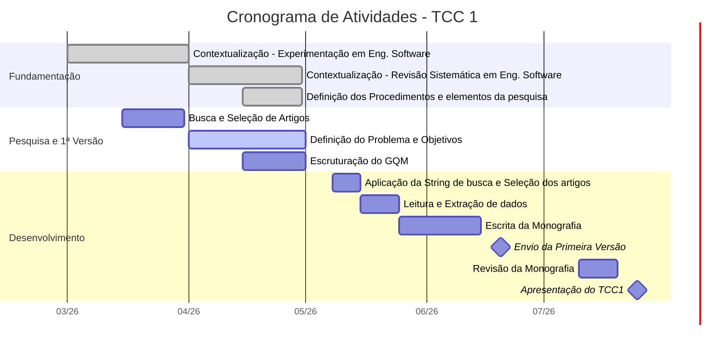

# Cronograma de TCC 1

**Período:** Março a Julho de 2026
**Deadline da Primeira Versão:** 20/06/2026
**Apresentação:** Julho/2026

## 📊 Gráfico de Gantt do TCC 1

## 🎯 Sprint: Entrega da Primeira Versão (até 20/06)
Principais marcos para garantir a entrega da primeira versão.

| Data | Atividade | Status |
| :--- | :--- | :--- |
| **Até 31/05** | Finalização: Contextualização em Exp. na Engenharia de Software | ⏳ Pendente |
| **Até 31/05** | Finalização: Contextualização em Exp. na Contínua | ⏳ Pendente |
| **01 a 05/06** | Definição do Protocolo e dos Objetivos de Pesquisa | ⏳ Pendente |
| **05 a 15/06** | Busca e Seleção de Artigos | ⏳ Pendente |
| **16 a 18/06** | Compilação e Escrita da Primeira Versão | ⏳ Pendente |
| **19/06** | Revisão Final do Documento da Primeira Versão | ⏳ Pendente |
| **20/06** | **Envio da Primeira Versão** | 🚨 **DEADLINE** |

---

## 📅 Visão Geral de Prazos (Março - Julho)

- [x] **Março / Abril:** Início das Contextualizações Teóricas
- [ ] **Maio:**
  - Finalização das Contextualizações (Eng. Software e Contínua)
  - Início da Definição de Protocolo, Objetivos e Busca de Artigos
- [ ] **Junho:**
  - Conclusão da Busca de Artigos
  - Escrita e Revisão do material base
  - **Entrega da Primeira Versão (20/06)**
  - Início da Leitura do Material Selecionado
- [ ] **Julho:**
  - Conclusão da Leitura e Escrita
  - Revisão Final do Material
  - **Apresentação do TCC1**
