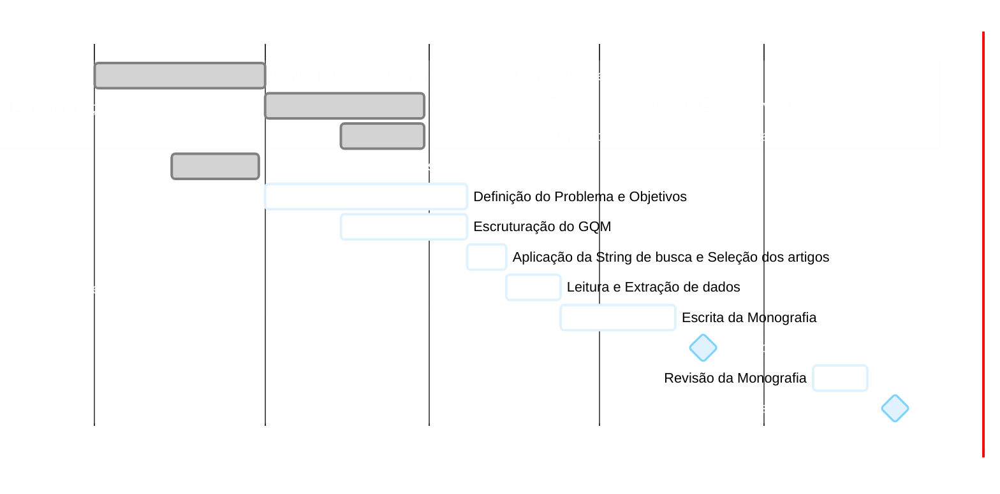

# Cronograma de TCC 1

**Período:** Março a Julho de 2026
**Deadline da Primeira Versão:** 20/06/2026
**Apresentação:** Julho/2026

## 📊 Gráfico de Gantt do TCC 1

## 🎯 Sprint: Entrega da Primeira Versão (até 20/06)
Principais marcos para garantir a entrega da primeira versão.

| Data | Atividade | Status |
| :--- | :--- | :--- |
| **Até 30/04** | Finalização das Contextualizações (Teóricas e Sistemática) | ✅ Concluído |
| **Até 08/05** | Definição do Problema, Objetivos e Escruturação do GQM | ⏳ Em Andamento |
| **08 a 15/05** | Aplicação da String de busca e Seleção dos artigos | ⏳ Pendente |
| **15 a 25/05** | Leitura e Extração de dados | ⏳ Pendente |
| **25/05 a 15/06** | Escrita da Monografia (Primeira Versão) | ⏳ Pendente |
| **16 a 19/06** | Revisão Final do Documento da Primeira Versão | ⏳ Pendente |
| **20/06** | **Envio da Primeira Versão** | 🚨 **DEADLINE** |

---

## 📅 Visão Geral de Prazos (Março - Julho)

- [x] **Março / Abril:** 
  - Contextualizações Teóricas e Definição de Procedimentos
  - Busca e Seleção de Artigos Iniciais
- [ ] **Maio:**
  - Definição do Problema, Objetivos e GQM
  - Aplicação da String de Busca e Seleção Final dos Artigos
  - Leitura e Extração de dados
  - Início da Escrita da Monografia
- [ ] **Junho:**
  - Conclusão da Escrita da Monografia
  - Revisão Final do Documento
  - **Entrega da Primeira Versão (20/06)**
- [ ] **Julho:**
  - Revisão da Monografia (Pós-entrega)
  - **Apresentação do TCC1 (25/07)**
